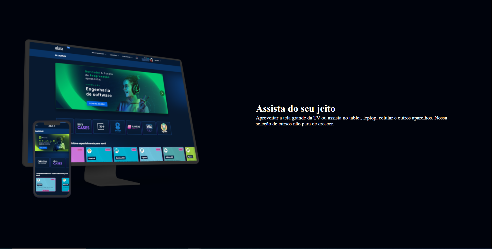
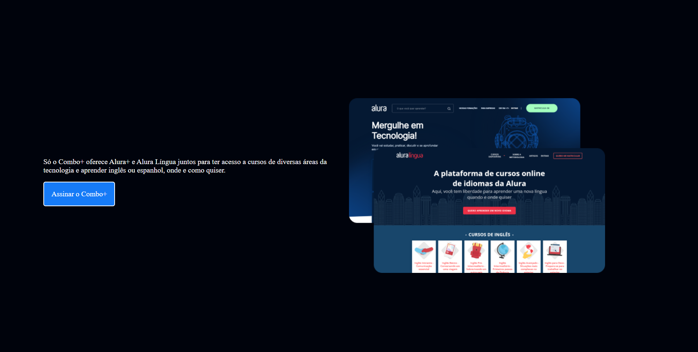
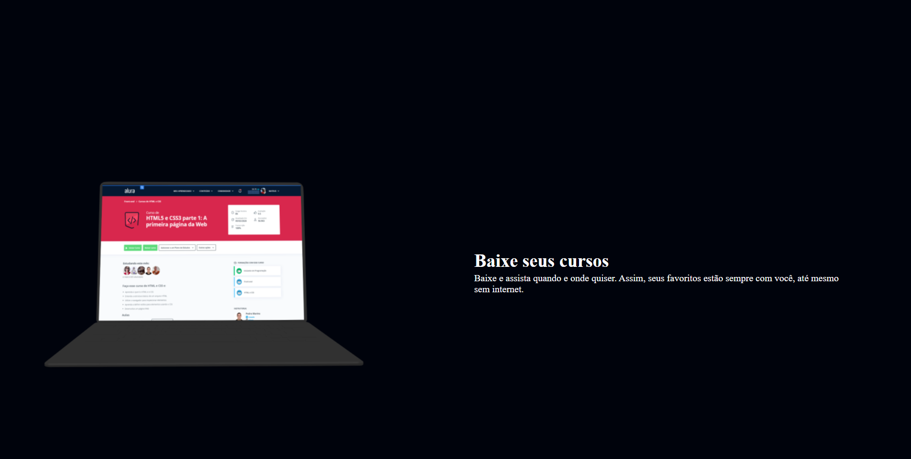
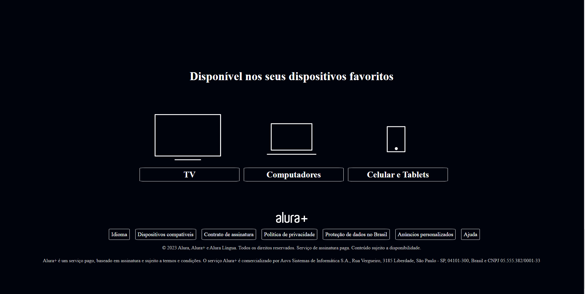

# SiteAlura-FrontEnd

# Sobre o projeto 

https://luizgustavonaves.github.io/SiteAlura-FrontEnd/

Site de propaganda da plataforma Alura onde foi possível colocar em prática novos conhecimentos e técnicas do desenvolvimento Front End em Html e Css. 

## Layout 

# Tecnologias Utilizadas

## Front end
- HTML / CSS

# Autor

Luiz Gustavo Naves Ferreira

https://www.linkedin.com/in/luizgustavonaves/

